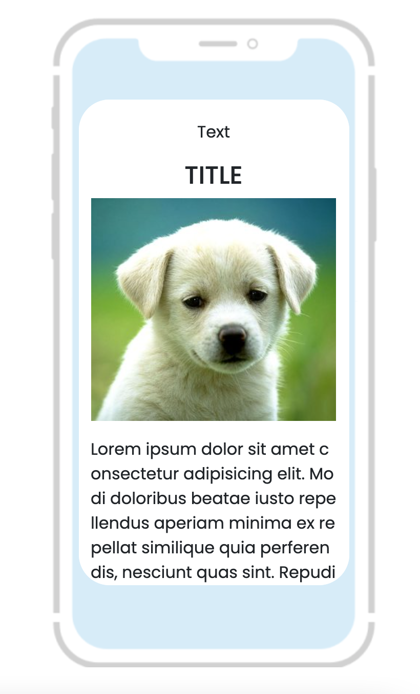

## Scripts

In the project directory, you can run:

### `npm install`

### `npm start`

Runs the app in the development mode.\
Open [http://localhost:3000](http://localhost:3000) to view it in the browser.

## live preview

Open [luxtag](https://luxtag-task.netlify.app/)

### Example

